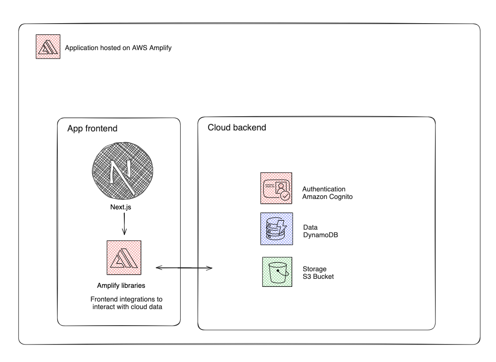

# Bucket List App Project

## Overview

Bucket List is a web application built with Next.js and hosted on AWS Amplify. The application allows users to create, read, and delete items from their personal bucket list. The project leverages AWS services such as Amplify for hosting and authentication, AppSync for GraphQL API, and DynamoDB for data storage.

## Features

- **Next.js Application**: Developed using the Next.js framework for a seamless React experience.
- **AWS Amplify Hosting**: Source code is uploaded and hosted on AWS Amplify for reliable and scalable web hosting.
- **Infrastructure as Code**: Backend infrastructure is provisioned using TypeScript.
- **Authentication**: User authentication is implemented using Amplify Authentication (powered by Amazon Cognito) for secure login and signup.
- **GraphQL API**: AWS AppSync is used to create a GraphQL API, providing a robust interface for data operations.
- **DynamoDB Integration**: The application uses DynamoDB for storing bucket list items, allowing for create, read, and delete operations.
- **S3 Bucket for Image Storage**: Images associated with bucket list items are stored securely in an S3 bucket, ensuring efficient retrieval and management (To Do: Implement).

## Architecture

### Frontend

The frontend is built using Next.js.

### Backend

The backend is powered by AWS services:

- **AWS Amplify**: Handles hosting, authentication, and integration with other AWS services.
- **AWS AppSync**: Manages the GraphQL API, enabling efficient data queries and mutations.
- **DynamoDB**: A NoSQL database used to store bucket list items, allowing for quick and scalable data access.
- **S3 Bucket**: (To Do: Implement) Implementation of an S3 bucket for storing images associated with bucket list items, ensuring efficient storage and retrieval.

---

Thank you for checking out the Bucket List project! I hope you find it useful and engaging.
